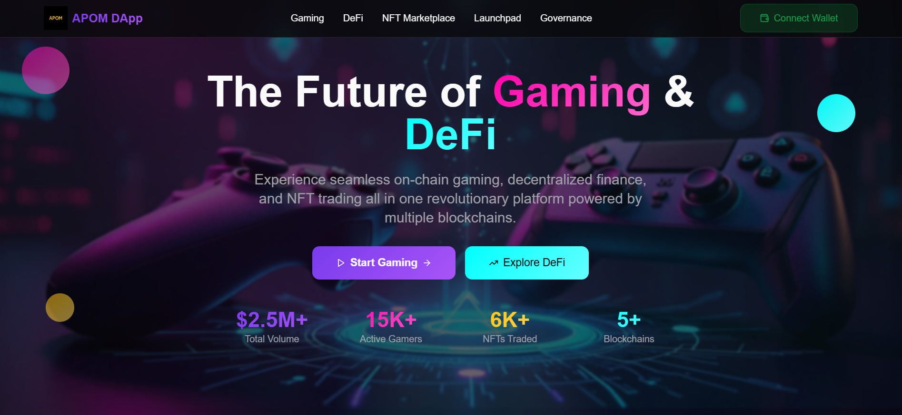

# 🛠️ Decentralized Gaming & DeFi Platform - Local Setup Guide

## 📸 Platform Screenshots

### Home Page - The Future of Gaming & DeFi

*Experience seamless on-chain gaming, decentralized finance, and NFT trading all in one revolutionary platform powered by multiple blockchains.*

### Gaming Hub - Play to Earn

*Play to earn, own your assets, and compete in the ultimate blockchain gaming ecosystem with featured games and leaderboards.*

### DeFi Exchange - Advanced Trading

*Trade, stake, and earn with advanced DeFi protocols designed for the gaming ecosystem with real-time liquidity pools and trading data.*

---

Welcome! 👋
This guide will walk you through setting up the **Decentralized Gaming & DeFi Platform** on your computer for development or testing.
No prior coding knowledge is required — just follow the steps carefully.

---

## 📦 Prerequisites

Before setting up the Decentralized Gaming & DeFi Platform, you need to install three tools:

### 1. Node.js (v22)

Node.js allows you to run JavaScript on your computer. Our project requires version **22**.

**Install:**

* Go to the [Node.js download page](https://nodejs.org/).
* Download the **LTS (Long-Term Support) version 22** for your operating system (Windows, macOS, or Linux).
* Run the installer and follow the instructions.
* ✅ **Important:** During installation, check the box:
  *“Automatically install the necessary tools”*

**Verify installation:**
Open your terminal (Command Prompt on Windows, Terminal on macOS/Linux) and run:

```bash
node -v
```

Expected output:

```
v22.x.x
```

> 💡 Node.js automatically installs **npm** (Node Package Manager), so you don’t need to install npm separately.

---

### 2. npm (Node Package Manager)

npm is used to install the extra libraries our project needs.

**Verify installation (already installed with Node.js):**

```bash
npm -v
```

Expected output:

```
10.x.x
```

---

### 3. Git (Version Control)

Git lets you download and manage the project’s source code.

**Install:**

* Go to the [Git official website](https://git-scm.com/downloads).
* Download the correct version for your operating system.
* Run the installer → keep the default settings unless you know otherwise.

**Verify installation:**

```bash
git --version
```

Expected output:

```
git version 2.x.x
```

---

## 🚀 Local Setup

Once you have Node.js, npm, and Git installed, follow these steps:

### Step 1: Clone the Repository

Copy the project from Bitbucket to your computer:

```bash
git clone https://bitbucket.org/web3_devs/apom_dapp.git
```

Move into the project folder:

```bash
cd apom_dapp
```

---

### Step 2: Install Dependencies

Install all required software packages:

```bash
npm install
```

This may take a few minutes.
After success, you’ll see a new folder called **node\_modules** inside the project.

---

### Step 3: Start the Project

Run the project locally:

```bash
npm run dev
```

* Your default browser should open automatically.
* If not, open [http://localhost:8080](http://localhost:8080) manually.
* You should now see the **Decentralized Gaming & DeFi Platform running** 🎉

---

✅ That’s it! You now have the **Decentralized Gaming & DeFi Platform** running locally.